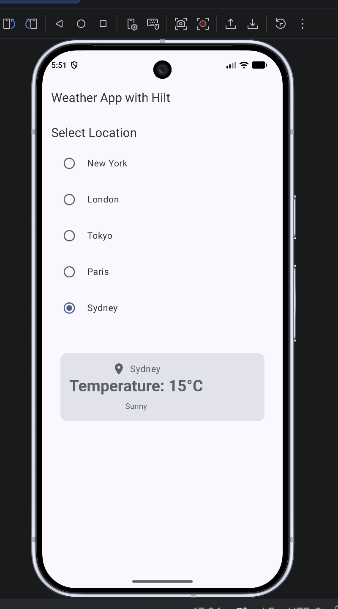

# 🌤️ Weather App — Jetpack Compose

A modern **Weather Android application** built using **Jetpack Compose** and **MVVM architecture**. The project demonstrates clean Android development practices including **Dagger Hilt dependency injection, StateFlow, Coroutines, Retrofit, and reactive UI state management**.

## 📱 App Preview

<p align="center">
  
</p>

## ✨ Features

* 🌤️ Current weather information
* 🌡️ Temperature and weather conditions
* 📍 Location-based weather
* 🔄 Reactive UI updates
* ⏳ Loading and error states
* 🌐 Weather data from REST API
* 💉 Dependency Injection using Dagger Hilt
* 🔁 State management using StateFlow
* 🎨 Modern UI using Jetpack Compose

## 🏗️ Architecture

The application follows the **MVVM (Model–View–ViewModel)** architecture.

```text
UI (Jetpack Compose)
        ↓
    ViewModel
        ↓
    Repository
        ↓
   Retrofit API
        ↓
   Weather API
```

### MVVM Components

**View**

* Jetpack Compose UI
* Observes UI state using `collectAsState()`

**ViewModel**

* Manages UI state
* Uses Kotlin Coroutines
* Exposes weather data using `StateFlow`

**Repository**

* Provides a single source of data
* Handles communication with the API

**Remote Data Source**

* Retrofit
* REST API

## 🛠️ Tech Stack

| Technology        | Usage                    |
| ----------------- | ------------------------ |
| Kotlin            | Programming Language     |
| Jetpack Compose   | UI                       |
| MVVM              | Architecture             |
| Dagger Hilt       | Dependency Injection     |
| StateFlow         | State Management         |
| Kotlin Coroutines | Asynchronous Programming |
| Retrofit          | API Communication        |
| Gson              | JSON Parsing             |
| Material 3        | UI Components            |

## 📂 Project Structure

```text
com.example.weatherapp
│
├── data
│   ├── remote
│   │   ├── WeatherApi.kt
│   │   └── WeatherResponse.kt
│   │
│   └── repository
│       └── WeatherRepository.kt
│
├── di
│   └── NetworkModule.kt
│
├── presentation
│   ├── WeatherScreen.kt
│   ├── WeatherViewModel.kt
│   └── WeatherUiState.kt
│
└── MainActivity.kt
```

## 🔄 State Management

The app uses **StateFlow** to expose UI state from the ViewModel.

```kotlin
private val _uiState = MutableStateFlow<WeatherUiState>(
    WeatherUiState.Loading
)

val uiState: StateFlow<WeatherUiState> = _uiState
```

The Compose UI observes the state:

```kotlin
val uiState by viewModel.uiState.collectAsState()
```

This allows the UI to automatically react when the weather state changes.

## 💉 Dependency Injection

**Dagger Hilt** is used for dependency injection.

Hilt provides dependencies such as:

* Retrofit
* Weather API service
* Repository
* ViewModel dependencies

This helps keep the application modular, testable, and easier to maintain.

## 🌐 API

The application communicates with a weather REST API using **Retrofit**.

```text
Compose UI
    ↓
ViewModel
    ↓
Repository
    ↓
Retrofit
    ↓
Weather API
```

> Add your API provider and API documentation link here if you want to make the project publicly reproducible.

## 🚀 Getting Started

### 1. Clone the repository

```bash
git clone https://github.com/YOUR_USERNAME/WeatherApp-Compose-MVVM.git
```

### 2. Open the project

Open the project in **Android Studio**.

### 3. Add your API key

If your weather API requires an API key, add it securely according to the API provider's instructions.

**Do not commit API keys or secrets to GitHub.**

### 4. Build and run

Sync Gradle and run the application on an Android emulator or physical device.

## 🎯 What I Practiced

This project helped me practice:

* Jetpack Compose UI development
* MVVM architecture
* Dagger Hilt dependency injection
* StateFlow and reactive state management
* Kotlin Coroutines
* Retrofit networking
* Repository pattern
* UI state handling
* Loading and error handling
* Modern Android development

## 👩‍💻 Author

**Nisha Kumari**

Android Developer | Kotlin | Jetpack Compose | MVVM

---

⭐ If you find this project useful, consider giving it a star!
